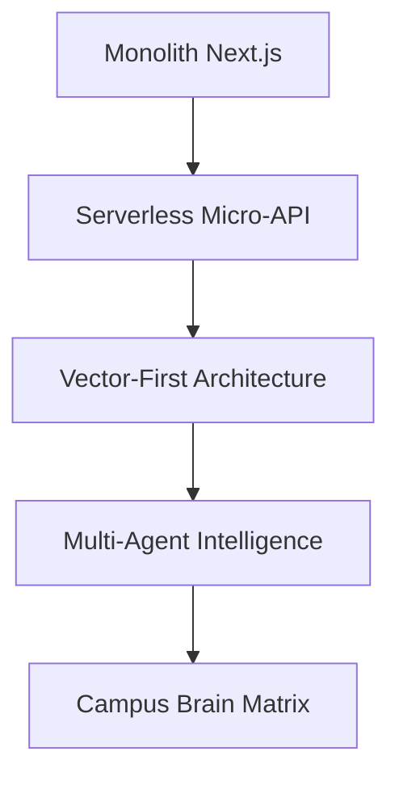

# 🚀 W.Y.A Campus: Intelligence Engine Roadmap

This document outlines 30 advanced features and the architectural phases required to transform W.Y.A (Where You At) into a fully-aware, high-engagement "Campus Brain."

---

## 🏗️ Phase 0: The Foundation (Completed ✅)
*Focus: Identity, Core Participation, and Visual Signature*

- [x] **Unified Identity**: Secure OTP-based authentication and profile generation.
- [x] **Participation Matrix**: A three-pillar system supporting RSVPs (Going/Interested), Material Pledges (Goods), and Financial Support (Donations).
- [x] **Premium Design Language**: High-fidelity glassmorphism UI with GSAP-powered micro-interactions.
- [x] **Resilient Event Management**: Atomic API-driven event creation and robust dashboard data fetching.

---

## 🏗️ Phase 1: The Core Intelligence (In Progress 🛠️)
*Focus: Semantic Discovery and Context-Aware Recommendation*

1. **Academic Rhythm Layer**: Dynamic scoring that shifts priority based on the university calendar (e.g., boosting study groups during finals).
2. **Semantic "Intent" Matching**: Using Gemini embeddings to match event descriptions to user bios/interests beyond simple keywords.
3. **Departmental Trending Heat**: Real-time boosts for events blowing up within a specific major or college.
4. **Social Proof Synergy**: "Matched because 4 people from your 'Computer Society' group are going."
5. **Transparency Tooltips**: AI-generated snippets explaining *why* an event is on your "Top Picks" feed.

**Technical Constraint**: Requires migration from Firestore native search to a Vector-indexed database (e.g., Pinecone or pgvector).

---

## 👥 Phase 2: Social & Peer Dynamics
*Focus: Viral Growth and Community Intersection*

6. **Intersecting Graphs**: Boosting events where multiple distinct friend groups are meeting.
7. **Freshman Integration Path**: Heavier weighting on social-proof for new users to help them build their first campus networks.
8. **Group RSVP Logic**: Recommending events to entire friend groups simultaneously via shared notifications.
9. **Mentorship Linking**: Highlighting events where seniors or alumni from the student's major are verified attendees.
10. **"Active Now" Proximity**: Real-time boost for events starting within 15 mins in the user's current building.

**Success Metric**: Increase in "Mutual Friend" attendance at club-level events by 25%.

---

## 🎓 Phase 3: Academic & Career Intelligence
*Focus: Professional Development and Skill Verification*

11. **Major-Adjacent Discovery**: Recommending events in overlapping fields (e.g., CS students seeing Math/Logic events).
12. **Career Goal Alignment**: Matching events to "Aspirational Skills" defined in the user profile.
13. **Professor Endorsements**: Boosting events "starred" by instructors in the student's current semester.
14. **Portfolio Synergy**: Prioritizing events that offer verified digital badges or skill certificates.
15. **Passive Interest Tracking**: Analyzing "hover time" and scroll depth on event cards to refine interest profiles.

---

## 🎮 Phase 4: Gamification & Behavioral Logic
*Focus: Retention and "Daily Active" Engagement*

16. **Recommendation Streaks**: Rewarding users for attending multiple AI-suggested events in a row.
17. **The "Wildcard" Daily**: One daily suggestion completely outside the user's typical profile to prevent filter bubbles.
18. **Frictionless FOMO**: High-visibility triggers for events with "Only 3 spots left" or high real-time check-in velocity.
19. **Senior Bucket List**: Prioritizing campus traditions for final-year students.
20. **Introvert/Extrovert Tuning**: Detecting preference for small workshops vs. massive festival-style events.

---

## 🍕 Phase 5: Logistics & Campus Vibe
*Focus: Environmental Context and Quality of Life*

21. **Benefit Sentiment Analysis**: AI scanning for "Free Food," "Pizza," or "Swag" to cater to student budgets.
22. **Weather-Adaptive Feeds**: Shifting to indoor venue recommendations automatically during rain/snow.
23. **Visual Aesthetic Matching**: AI poster analysis to match the visual "vibe" the user typically engages with.
24. **Circadian Scheduling**: Matching event times to the student's historical peak activity hours.
25. **Venue Exploration**: Occasionally suggesting events in unexplored campus buildings.

---

## 🧠 Phase 6: Next-Gen Integration
*Focus: Zero-UI and Autonomous Personal Assistants*

26. **Syllabus-Linked Events**: Suggested study sessions synced with upcoming exam dates via calendar integration.
27. **Club Affinity Matrix**: Mapping relationships between clubs (e.g., Robotics <-> AI Society) for better cross-promotion.
28. **Vibe Reviews**: NLP-based analysis of past attendee comments to rank the "energy" of recurring events.
29. **Real-time Crowdsourcing**: Boosting events with high check-in rates in the last 60 minutes.
30. **Autonomous Concierge**: A personalized LLM agent that can book "Study/Social" blocks in your calendar automatically.

**Future Vision**: W.Y.A evolves into a wearable/AR overlay, highlighting "Hot Zones" of student activity in real-time.

---

## 🛠️ Architectural Evolution Path

---
*Last Updated: 2026-05-06*
