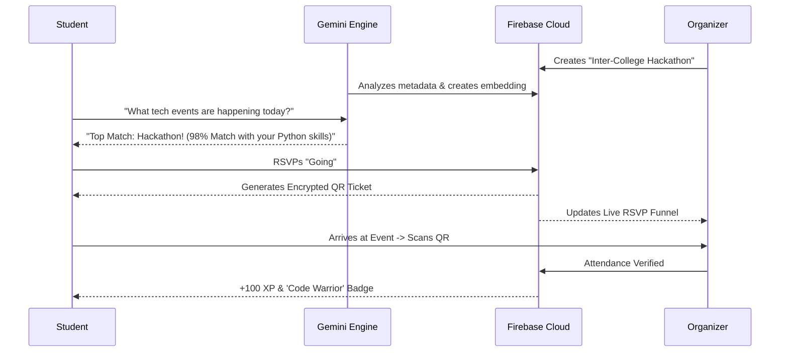

<div align="center">

# 🎓 CampusPulse
### **The Intelligent Neural Nexus for Campus Life**

[](https://nextjs.org/)
[](https://react.dev/)
[](https://tailwindcss.com/)
[](https://firebase.google.com/)
[](https://ai.google.dev/)
[](https://www.typescriptlang.org/)

> [!IMPORTANT]
> **CampusPulse is currently under active development.**
> We are in the process of pivoting from the NexusAid disaster relief foundation to a full-scale Intelligent Campus Event Engine. Expect frequent updates, evolving features, and breaking changes as we build the future of campus engagement.

**"Never miss a beat. Never miss a moment. Never miss what matters."**

[Explore the Feed](#-unified-event-discovery) • [Meet the Concierge](#-ai-native-operations) • [How it Works](#-the-campuspulse-journey) • [Setup Guide](#-deployment-blueprint)

---

### 🚀 The Vision
**CampusPulse** isn't just an event app—it's an **Intelligent Recommendation Engine** designed to solve the "Fragmented Campus Problem." No more hunting through WhatsApp groups, missed posters, or forgotten emails. We leverage **Generative AI** and **Real-time Geospatial Intelligence** to bring every hackathon, cultural fest, and workshop directly to the students who care about them.

</div>

---

## 💎 Premium Innovation Pillars

### 🧠 **Neural Interest Matching**
Forget generic lists. Our **proprietary scoring algorithm** analyzes student academic tracks, skill sets, and personal interests to deliver a hyper-personalized "Top Picks" feed.
- **Dynamic Relevance**: See exactly *why* an event was picked for you (e.g., *"Matches your interest in 'Fullstack Development' & 'Hackathons'"*).
- **Infinite Discovery**: Semantic search powered by **Gemini 1.5 Flash** lets you search for *intent*, not just keywords.

### 🛡️ **The Campus Bulletin (Live Sentinel)**
Repurposing high-frequency monitoring technology into a live campus pulse.
- **Trending Now**: Visual heatmaps of event popularity based on real-time RSVP velocity.
- **Live Broadcasts**: Instant notifications for "Happening Now" events and critical club announcements.
- **Geospatial Intelligence**: A high-fidelity Leaflet map showing every pulse-point across the campus grid.

### 📢 **Professional Organizer Suite**
Empowering club leads with tools that usually cost thousands.
- **AI Poster & Copy**: Generate stunning event descriptions and promotional graphics in seconds with built-in GenAI tools.
- **Omni-Channel Promotion**: Batch-upload member lists (.csv/.xlsx) and blast invites via **Simultaneous Email & SMS**.
- **The Analytics Edge**: Deep-dive into student engagement funnels—from view to verified check-in.

### 🎟️ **The Frictionless Gateway**
- **Digital Identity**: Secure QR-based ticketing system.
- **In-App Scanner**: Organizers can validate attendees at the door with a single tap.
- **Gamified Growth**: Earn **XP** and **Badges** for every pulse you join. Climb the campus leaderboard and become a legendary contributor.

---

## 🛠 **The Tech Stack of the Future**

| Layer | Technology | Why? |
| :--- | :--- | :--- |
| **Framework** | **Next.js 15+ (App Router)** | For the fastest possible server-side rendering and edge deployment. |
| **Style** | **Tailwind CSS 4.0** | Ultra-modern, utility-first design system with high-performance glassmorphism. |
| **Brain** | **Google Gemini 1.5 Flash** | Multi-modal intelligence for semantic search and content generation. |
| **State** | **Firebase Realtime Suite** | Instant synchronization of chats, RSVPs, and live announcements. |
| **Comms** | **Twilio & Nodemailer** | The gold standard for reliable SMS and professional email automation. |
| **Motion** | **Framer Motion** | Silky-smooth transitions that make the app feel alive and responsive. |

---

## 🏗 **The CampusPulse Journey**



---

## 📂 **Inside the Engine**

```bash
├── 📁 src/
│   ├── 📁 app/               # Next.js 15 App Router & API Matrix
│   ├── 📁 components/        # Premium UI (Glassmorphism, Maps, AI Concierge)
│   ├── 📁 context/           # Neural Auth & Global Application State
│   ├── 📁 services/          # The Brain (Matching Logic, Search, Comms)
│   ├── 📁 types/             # High-Fidelity Type Definitions
│   └── 📁 styles/            # Design System Tokens & Global CSS
├── 📄 PIVOT_PLAN.md          # The architecture migration blueprint
└── 📄 tailwind.config.ts     # The color and spacing DNA
```

---

## ⚙️ **Deployment Blueprint**

### 1. Prime the Environment
Create a `.env.local` and inject the following fuel:
```env
# Firebase Cloud
NEXT_PUBLIC_FIREBASE_API_KEY=...
NEXT_PUBLIC_FIREBASE_PROJECT_ID=...

# Intelligence
GEMINI_API_KEY=...

# Communication Matrix
EMAIL_USER=...
EMAIL_PASS=...
TWILIO_SID=...
TWILIO_AUTH=...
```

### 2. Ignite the Server
```bash
npm install     # Load the modules
npm run dev     # Launch the pulse
```

---

## 🛡 **Security & Trust**
- **Authenticated Identity**: Secure Google SSO and Email OTP verification.
- **Server-Side Integrity**: Sensitive operations (Payments, Bulk Comms, User Updates) are handled via **Firebase Admin SDK** for maximum security.
- **Privacy-First**: No data sharing. Your interests stay on your pulse.

---

<div align="center">

### **Built for the ambitious. Driven by intelligence. Powering the campus.**

Developed with ❤️ to bridge the gap between students and opportunities.

[**Get Started Now**](https://github.com/your-repo/campuspulse) • [**Report a Bug**](https://github.com/your-repo/campuspulse/issues)

</div>
