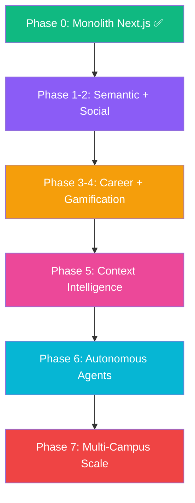

# 🚀 W.Y.A Campus: Intelligence Engine Roadmap

This document outlines **30 advanced features** and the architectural phases required to transform W.Y.A (Where You At) into a fully-aware, high-engagement "Campus Brain." Each feature is grounded in the existing codebase and designed to build incrementally on what's already shipped.

---

## 🏗️ Phase 0: The Foundation (Completed ✅)
*Focus: Identity, Core Participation, and Visual Signature*

- [x] **Unified Identity**: 3-step OTP authentication (send → verify → confirm) with Nodemailer SMTP.
- [x] **Participation Matrix**: Three-pillar system — RSVPs (Going/Interested), Material Pledges (Goods), Financial Support (Donations via Razorpay).
- [x] **Premium Design Language**: Neobrutalist-accented SaaS UI with GSAP PillNavbar, Framer Motion transitions, and a 682-line design token system.
- [x] **Resilient Event Management**: Admin SDK-exclusive writes with 15 API route groups and 98-line Firestore security lockdown.
- [x] **AI-Powered Creation**: Gemini 1.5 Flash integration for event description generation, category tagging, and a floating AI campus assistant.
- [x] **Digital Wallet**: Offline-capable QR ticket storage with organizer scanner check-in.
- [x] **Recommendation Engine**: Multi-signal event scoring (interests, department, clubs, history, urgency, social proof).
- [x] **Interest Archetypes**: Persona classification system (Explorer, Hustler, Artist, etc.) displayed on profile.

---

## 🧠 Phase 1: Semantic Intelligence & Context (Next Up 🛠️)
*Focus: Moving from keyword matching to true understanding*

### 1. 🔍 Vector Semantic Search
Migrate from Firestore `where` queries to Gemini-native embeddings or a dedicated vector store (Pinecone/pgvector). Users search for *"chill music vibes tonight"* and get matched on meaning, not keywords.
- **Builds on**: `searchService.ts`, `recommendationService.ts`
- **Complexity**: High — requires embedding pipeline and index management

### 2. 📅 Academic Rhythm Layer
Dynamic scoring that detects university calendar phases (orientation week, midterms, finals, summer). Automatically boosts study groups during exam season and social events during orientation.
- **Builds on**: `recommendationService.ts` scoring signals
- **Data needed**: University academic calendar API or manual config

### 3. 🎯 Transparency Tooltips
AI-generated micro-explanations on every recommended event card: *"Suggested because 3 people from your Robotics Club are going and it matches your 'coding' interest."*
- **Builds on**: `InterestMatchBanner.tsx`, `ScoredEvent.reasons[]`
- **Complexity**: Low — data is already computed, needs UI surfacing

### 4. 🔥 Departmental Trending Heat
Real-time detection of events "blowing up" within a specific department. If 15 CS students RSVP in 10 minutes, surface it to all CS students with a "Trending in your department" badge.
- **Builds on**: `eventService.ts` RSVP data, `UserProfile.department`
- **Complexity**: Medium — requires real-time aggregation

### 5. 🧬 Deep Persona Evolution
Extend the Interest Archetype system to track behavioral patterns over time. A student who starts as "Explorer" but consistently attends hackathons evolves into "Tech Hustler." Show persona evolution timeline on the profile.
- **Builds on**: `personaUtils.ts`, `UserProfile.rsvpEventIds`
- **Complexity**: Medium — requires historical analysis

---

## 👥 Phase 2: Social Graph & Peer Dynamics
*Focus: Making campus connections visible and actionable*

### 6. 🕸️ Intersecting Social Graphs
Detect when multiple distinct friend groups converge at the same event. Surface: *"Your CS study group AND your Basketball team are both going."*
- **Data needed**: Implicit social graph from co-attendance patterns
- **Complexity**: High — graph analysis required

### 7. 🐣 Freshman Integration Paths
Heavier social-proof weighting for new users (< 30 days on platform). Show "Popular with freshmen" badges and curate a dedicated "Getting Started" feed with orientation-friendly events.
- **Builds on**: `UserProfile.createdAt`, recommendation scoring
- **Complexity**: Low-Medium

### 8. 👥 Group RSVP
Allow a user to RSVP on behalf of a friend group. Send group invitations and track group attendance as a unit.
- **Builds on**: `RSVPModal.tsx`, `eventService.ts`
- **Complexity**: Medium — needs group entity and invitation flow

### 9. 🎓 Mentorship Linking
Highlight events where seniors or alumni from the student's major are verified attendees. Show "Mentors attending" badges on event cards.
- **Builds on**: `UserProfile.year`, `UserProfile.department`, RSVP data
- **Complexity**: Medium

### 10. 📍 "Active Now" Proximity Boost
Real-time boost for events starting within 15 minutes near the user's current location. Uses the existing `geo.ts` utilities and `LocationPicker.tsx` infrastructure.
- **Builds on**: `utils/geo.ts`, `CommunityEvent.lat/lng`
- **Complexity**: Medium — requires location permission and real-time scheduling

---

## 🎓 Phase 3: Academic & Career Intelligence
*Focus: Bridging campus life with professional development*

### 11. 🔗 Major-Adjacent Discovery
Recommend events in overlapping academic fields. CS students see Math/Logic events; Architecture students see Art exhibitions. Uses a predefined adjacency matrix of departments.
- **Builds on**: `Department` type, `recommendationService.ts`
- **Complexity**: Low

### 12. 🎯 Career Goal Alignment
New profile field: "Aspirational Skills" (e.g., Machine Learning, Public Speaking). Match events offering workshops, talks, or certifications in those areas.
- **Builds on**: `UserProfile`, event tags
- **Complexity**: Medium — requires profile field + matching logic

### 13. 🏅 Digital Badge Certificates
Issue verifiable digital badges for event completion (e.g., "Completed Hackathon 2026"). Badges display on the profile and can be exported as PDF certificates.
- **Builds on**: `UserProfile.badges[]`, profile page
- **Complexity**: Medium — needs badge design + PDF generation

### 14. 📊 Skill Radar Visualization
Interactive radar chart on the profile page showing skill development across categories (Technical, Creative, Leadership, Social, Academic) based on event attendance history.
- **Builds on**: `UserProfile.rsvpEventIds`, `CommunityEvent.category`
- **Complexity**: Medium — needs chart library + data aggregation

### 15. 👨‍🏫 Professor Endorsement Badges
Allow faculty accounts to "star" or endorse events. Events with professor endorsements get a special badge and scoring boost for students in that professor's courses.
- **Builds on**: `UserProfile.role` (needs `faculty` role), event metadata
- **Complexity**: Medium-High

---

## 🎮 Phase 4: Gamification & Behavioral Engagement
*Focus: Daily active engagement and healthy competition*

### 16. 🔥 Recommendation Streaks
Track consecutive attendance at AI-recommended events. Reward 3-day, 7-day, and 30-day streaks with bonus XP and exclusive badges.
- **Builds on**: `UserProfile.xp`, `UserProfile.badges`, recommendation tracking
- **Complexity**: Low-Medium

### 17. 🎲 "Wildcard" Daily Discovery
One daily suggestion completely outside the user's typical profile to prevent filter bubbles. A CS student might get a poetry slam recommendation. Includes a "Try Something New" badge for attending.
- **Builds on**: `recommendationService.ts` (inverse scoring)
- **Complexity**: Low

### 18. ⏰ FOMO Urgency Triggers
High-visibility real-time triggers: "Only 3 spots left," "12 people joined in the last hour," "Starts in 20 minutes." Uses event capacity and RSVP velocity data.
- **Builds on**: `EventNeeds.attendees`, `CommunityEvent.maxAttendees`
- **Complexity**: Low-Medium

### 19. 🎓 Senior Bucket List
For final-year students: auto-curate a "Campus Traditions" list of must-attend events before graduation. Track completion percentage on the profile.
- **Builds on**: `UserProfile.year`, curated event tags
- **Complexity**: Low

### 20. 🧘 Introvert/Extrovert Tuning
Detect preference for small workshops (< 20 people) vs. massive festivals (200+) based on attendance history. Adjust recommendation sizing accordingly.
- **Builds on**: `CommunityEvent.maxAttendees`, attendance patterns
- **Complexity**: Low-Medium

---

## 🍕 Phase 5: Logistics & Campus Vibe Intelligence
*Focus: Environmental context and quality-of-life enhancements*

### 21. 🍕 Benefit Sentiment Scanning
AI scans event descriptions for perks: "Free Food," "Pizza," "Swag," "Certificates." Surface a perk badge on event cards for budget-conscious students.
- **Builds on**: Gemini text analysis, `CommunityEvent.description`
- **Complexity**: Low — prompt engineering + badge UI

### 22. 🌧️ Weather-Adaptive Feeds
Integrate a weather API. During rain or extreme heat, automatically boost indoor venue events and suppress outdoor ones. Show weather context on feed.
- **Data needed**: Weather API (OpenWeatherMap free tier)
- **Complexity**: Low-Medium

### 23. 🎨 Visual Vibe Matching
AI analysis of event poster images to match the visual "aesthetic" the user typically engages with. Artsy users see illustrated posters first; tech users see sleek minimalist designs.
- **Builds on**: Gemini Vision, `CommunityEvent.imageUrl`
- **Complexity**: High — requires image analysis pipeline

### 24. 🕐 Circadian Scheduling
Match event times to the student's historical peak activity hours. Night owls see late-evening events first; early risers see morning workshops.
- **Builds on**: RSVP timestamp analysis, `UserProfile`
- **Complexity**: Medium

### 25. 🏛️ Venue Explorer Mode
Occasionally suggest events in campus buildings the student has never visited. Includes a "Venues Explored" tracker on the profile.
- **Builds on**: `CommunityEvent.location`, attendance history
- **Complexity**: Low-Medium

---

## 🔮 Phase 6: Next-Gen Intelligence & Integration
*Focus: Zero-UI interactions and autonomous assistance*

### 26. 📚 Syllabus-Linked Events
Calendar integration (Google Calendar API) to detect upcoming exams and automatically suggest relevant study sessions, review groups, or professor office hours.
- **Complexity**: High — requires calendar OAuth + event correlation

### 27. 🤝 Club Affinity Matrix
Map relationships between campus clubs (Robotics ↔ AI Society, Drama ↔ Film Club). Cross-promote events between related clubs automatically.
- **Builds on**: `UserProfile.clubs`, `CommunityEvent.clubName`
- **Complexity**: Medium — needs affinity mapping

### 28. 💬 Vibe Reviews & Sentiment
NLP-based analysis of past attendee chat messages and feedback to generate "energy ratings" for recurring events: "High Energy 🔥" vs. "Chill Vibes 🧘".
- **Builds on**: `ChatMessage` data, Gemini NLP
- **Complexity**: Medium-High

### 29. 📡 Real-Time Crowdsourcing Boosts
Detect events with high check-in velocity (many QR scans in the last 30 minutes) and boost them to nearby students with "Happening Now 🔴" banners.
- **Builds on**: Scanner check-in timestamps, `geo.ts`
- **Complexity**: Medium

### 30. 🤖 Autonomous Campus Concierge
A personalized LLM agent (Gemini) that can analyze your schedule, interests, and upcoming deadlines to automatically suggest "Study/Social" time blocks and pre-RSVP to relevant events with your permission.
- **Builds on**: `AIChatWidget.tsx`, calendar integration, recommendation engine
- **Complexity**: Very High — requires agent architecture

---

## 🆕 Phase 7: Platform Scale & Monetization
*Focus: Multi-campus deployment and sustainable growth*

### 31. 🏫 Multi-Campus Federation
Deploy W.Y.A across multiple universities with shared event discovery. Students can discover events at partner campuses and cross-register.
- **Complexity**: Very High — needs tenant architecture

### 32. 📱 Progressive Web App (PWA)
Full PWA with service worker, offline mode, push notifications, and home screen installation. Digital Wallet tickets work completely offline.
- **Builds on**: Digital Wallet, existing responsive design
- **Complexity**: Medium

### 33. 🏆 Departmental Leaderboards
Per-department XP rankings with semester-based seasons. Top participants earn "Department Champion" badges and real-world recognition.
- **Builds on**: `EngagementLeaderboard.tsx`, `UserProfile.department`
- **Complexity**: Low-Medium

### 34. 📧 Smart Digest Emails
Weekly AI-curated digest email: "Here's what's happening this week based on your interests." Includes personalized event picks and campus trending topics.
- **Builds on**: `emailService.ts`, `recommendationService.ts`
- **Complexity**: Medium

### 35. 🗺️ Interactive Campus Heat Map
Real-time visualization of campus activity density. See which buildings are "hot" right now based on active event check-ins.
- **Builds on**: `MapArea.tsx`, `LocationPicker.tsx`, Leaflet
- **Complexity**: Medium-High

### 36. 📊 Organizer Analytics Suite
Comprehensive post-event analytics for organizers: attendance demographics, peak check-in times, RSVP churn rates, and AI-generated improvement suggestions.
- **Builds on**: Dashboard page, event RSVP/scan data
- **Complexity**: Medium

### 37. 🎟️ Tiered Event Ticketing
Support for free, paid, and VIP ticket tiers. Integration with Razorpay for paid events, with automatic receipt generation and refund handling.
- **Builds on**: `create-payment-order` API, `RSVPModal.tsx`
- **Complexity**: Medium-High

### 38. 🔔 Smart Notification Routing
ML-based notification timing: send push notifications when the user is most likely to engage (based on historical open rates). Prevent notification fatigue.
- **Builds on**: `notificationService.ts`, user activity patterns
- **Complexity**: High

### 39. 📸 Event Memory Gallery
Post-event photo gallery where attendees can upload and view shared memories. AI auto-tags participants and generates event highlight reels.
- **Builds on**: `storageService.ts`, Gemini Vision
- **Complexity**: Medium-High

### 40. 🤝 Sponsor & Partnership Portal
Allow local businesses to sponsor events with perks (free food, swag). Sponsors get visibility badges on event cards and analytics on reach.
- **Complexity**: High — needs separate portal and billing

---

## 🛠️ Architectural Evolution Path

### Tech Stack Evolution

| Phase | Current | Target |
| :--- | :--- | :--- |
| **Search** | Firestore `where` queries | Gemini Embeddings + pgvector |
| **Hosting** | Vercel / Firebase Hosting | Edge Functions + CDN |
| **Email** | Gmail SMTP (Nodemailer) | Resend / SendGrid |
| **Payments** | Razorpay (India) | Stripe (Global) + Razorpay |
| **Analytics** | Custom dashboard | PostHog / Mixpanel |
| **Notifications** | In-app only | FCM Push + Email Digest |
| **AI** | Gemini 1.5 Flash | Gemini 2.0 + Custom Fine-Tuned |

---

## 📊 Feature Priority Matrix

| Priority | Features | Sprint |
| :--- | :--- | :--- |
| 🔴 **Critical** | Vector Search (#1), PWA (#32), Ticket E2E | Guardian (Current) |
| 🟠 **High** | Transparency Tooltips (#3), Streaks (#16), FOMO (#18) | Next Sprint |
| 🟡 **Medium** | Social Graph (#6), Weather (#22), Digest (#34) | Q3 2026 |
| 🟢 **Low** | Sponsor Portal (#40), Multi-Campus (#31) | Q4 2026+ |

---
*Last Updated: 2026-05-08 — Total Features: 40 (30 new + 10 shipped)*
